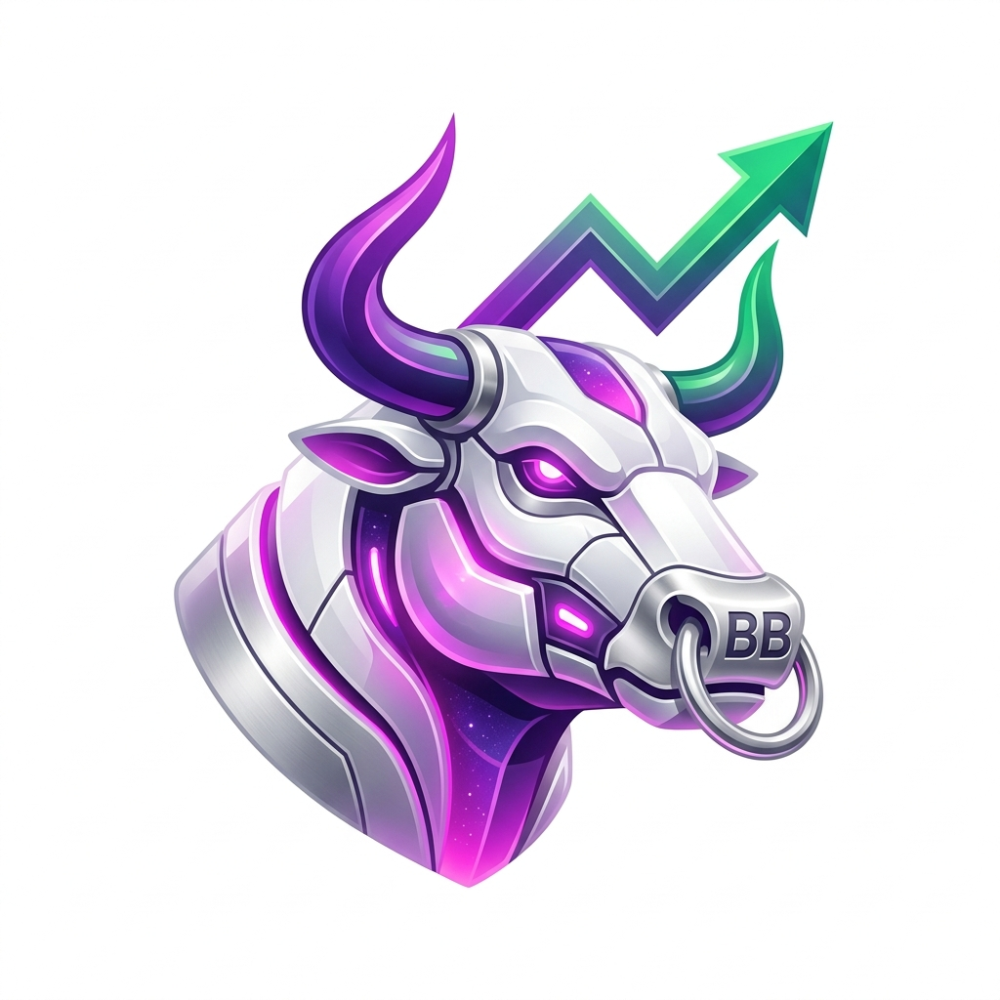

#  Bot Bulls

An automated, quantitative algorithmic trading system featuring a high-performance **Elite V2 Dashboard**, a multi-indicator confluence engine, real-time AI sentiment analysis, and a stateful risk management execution system.

---

## 🐂 What is BotBulls?

**BotBulls** is an intelligent, automated trading assistant designed to execute high-probability stock and cryptocurrency trades. Instead of relying on gut feelings, emotion, or single-indicator strategies, BotBulls operates like a professional trading desk. It aggregates quantitative technical indicators, real-time news sentiment, and stateful risk controls to scan the markets and execute trades through **Webull OpenAPI** (supporting paper trading, live trading, and data-only modes).

At its core, the bot runs a high-performance, non-blocking scan loop that analyzes tickers, computes technical confluences, performs real-time AI sentiment analysis via Groq (LLaMA-3), and adjusts stop-losses and take-profits dynamically.

---

## 📈 How You Can Profit Using BotBulls

BotBulls provides retail traders with tools and execution capabilities typically reserved for institutional quantitative hedge funds. Here is how you can maximize your profitability using the bot:

### 1. Leverage Multi-Indicator Confluence (No More Emotional Decisions)
Most traders lose money because they trade on emotion or buy when a single indicator (like RSI) looks oversold. BotBulls uses a **Confluence Engine** of up to 10 technical indicators:
*   **Volatility & Trend:** Supertrend, Bollinger Bands, SMA, EMA Cross, ADX Trend.
*   **Momentum & Volume:** RSI, MACD, VWAP, Mystic Pulse V2.0 (proprietary momentum flow oscillator).
*   **Price Action:** Candlestick Patterns (Bullish engulfing, hammers, etc.).

> [!TIP]
> **The Profit Strategy:** Set a high **Buy/Sell Confluence Threshold** (e.g., 6 or 7 indicators out of 10). The bot will remain patient and only enter trades when a strong, mathematical consensus is reached, drastically reducing false entries.

### 2. Shield Capital with AI Sentiment Filters
A perfect technical setup can be wiped out in seconds by a bad earnings report or negative news. BotBulls integrates **Groq (LLaMA-3) AI Sentiment Analysis**:
*   The bot fetches real-time market news and social signals for your active assets.
*   The LLaMA-3 brain grades the sentiment from `-100` (extremely bearish) to `+100` (extremely bullish).
*   **The Veto Power:** Even if technical indicators trigger a buy, the AI can veto the trade if sentiment is net-negative, protecting you from buying into a "bull trap" or a crashing market.

### 3. Stateful Trailing Stops (Locking in Profits while Letting Winners Run)
Traders often exit winning trades too early out of fear, or hold onto losing trades hoping they'll turn around. BotBulls implements an advanced **Stateful Risk Manager**:
*   **ATR-Based Stops:** Automatically calculates stop-loss (SL) and take-profit (TP) levels based on the asset's Average True Range (ATR)—adapting dynamically to high-volatility and low-volatility conditions.
*   **Stateful Trailing Stop-Loss:** As the stock price moves higher in your favor, the bot automatically moves the stop-loss up. If the trend reverses, your position is closed at the peak, locking in maximum gains.
*   **Position Sizing:** Caps the risk per trade to a strict percentage of your account balance (e.g., 2%), protecting you from catastrophic drawdowns.

### 4. Zero-Risk Strategy Optimization (High-Fidelity Backtester)
Never risk real money on an unproven strategy. BotBulls includes an **Elite Backtesting Suite**:
*   Simulate years of historical market data on stocks or crypto in seconds.
*   Instantly review key performance metrics: **ROI (Return on Investment)**, **Win Rate %**, **Max Drawdown**, and **Profit Factor**.
*   **The Profit Strategy:** Optimize your thresholds, indicators, and timeframes on paper first. Once you find a configuration that has a positive expected value, deploy it to active live/paper bots with one click.

### 5. Extended Hours Coverage (Front-Running Market Open)
Big market movements often happen overnight or during earnings releases when regular markets are closed. BotBulls supports **Extended Trading Hours (ETH)** for regular stocks:
*   Run the bot pre-market and after-hours.
*   Identify overnight price moves and execute momentum trades before the retail crowd can trade at the 9:30 AM market open.

---

## 🚀 Key Features

*   **Elite V2 Command Center**: A professional-grade backtesting and monitoring dashboard with glassmorphic UI, real-time TradingView charts, and responsive 3D-style controls.
*   **Unified Active Bots Console**: Create, pause, and monitor multiple active automated strategies simultaneously.
*   **Webull Integration**: Seamlessly connect your API credentials via Webull OpenAPI SDK for instant Paper, Live, or data-only execution.
*   **Multithreaded Cloud Architecture**: Automatically persists active bots, trade logs, and performance metrics securely to Cloud Firestore without blocking the main trading thread.

---

## 🛠️ Technical Stack

*   **Backend**: Python 3.10+, FastAPI, Pandas, TA-Lib, Groq SDK, Firestore SDK.
*   **Frontend**: HTML5, Vanilla CSS3 (Custom Glassmorphism), Javascript (ES6+), Lightweight Charts (TradingView CDN).
*   **Broker & Market Data**: Webull OpenAPI (Official Python SDK) & Yahoo Finance API (Historical fallback).

---

## 🛡️ Risk Disclosure

Algorithmic trading involves significant risk of loss. This software is provided for educational and research purposes only. Always test your strategies in simulation/paper mode before committing real capital.

---
*Built with 🐂 and ❤️ for High-Performance Quant Trading.*
